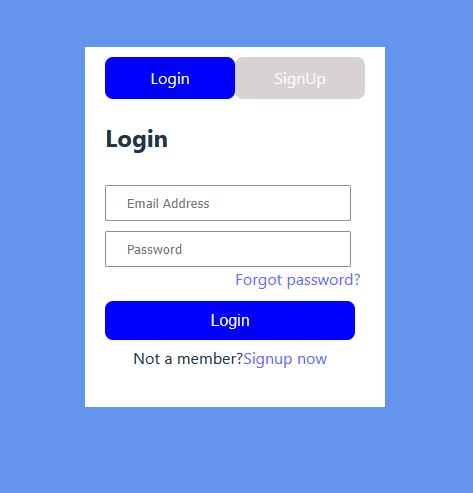

# 🔐 React Login Page

A simple and stylish Login Page built with **React.js**, designed for beginners and developers to understand form handling, state management, and basic styling in React.

---

## 📸 Preview

---

## 🚀 Features

- Modern React functional component structure
- Input fields for email/username and password
- Real-time form validation (if added)
- Button click feedback
- Responsive and mobile-friendly layout
- Clean and readable code

---

## 🛠️ Built With

- [React.js](https://reactjs.org/)
- HTML5
- CSS3
- VS Code

---

